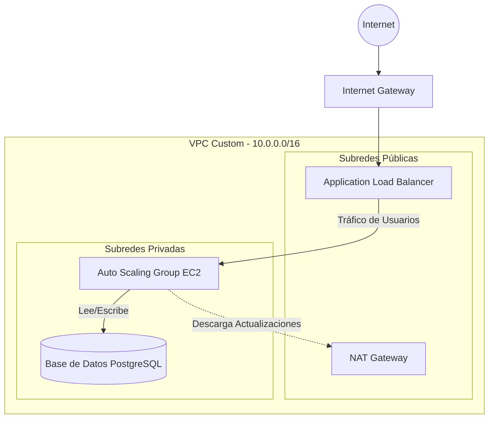

# 🚀 Arquitectura Web Resiliente y Desacoplada en AWS

Un backend Cloud de nivel empresarial aprovisionado al 100% como Infraestructura como Código (IaC) mediante **Terraform**.

## 🎯 Resumen de la Arquitectura
Esta infraestructura está diseñada para ser altamente disponible (Multi-AZ), segura (recursos críticos aislados en redes privadas) y escalable automáticamente según el tráfico.



## 🛠️ Tecnologías Principales
- **AWS VPC & Networking:** Red Multi-AZ con subredes públicas y privadas, usando NAT Gateways.
- **AWS ALB & Auto Scaling:** Balanceo de carga y autoescalado dinámico de servidores web.
- **AWS RDS & Secrets Manager:** Base de datos segura sin credenciales en el código fuente.
- **AWS S3 & DynamoDB:** Almacenamiento de estado remoto (`.tfstate`) y State Locking.
- **Terraform:** Estructura modular avanzada.

## 📂 Estructura del Proyecto (Módulos)
```text
terraform/
├── main.tf              # Llama y orquesta los submódulos
├── provider.tf          # Configuración del proveedor y Backend S3
├── variables.tf         # Variables globales del entorno
├── outputs.tf           # Datos de salida finales (ej. URL del Balanceador)
└── modules/             # Piezas lógicas reutilizables
    ├── network/         # VPC, Subredes, IGW, NAT, Tablas de Rutas
    ├── database/        # Amazon RDS y Secrets Manager
    └── compute/         # ALB, Launch Templates, Auto Scaling Group
```

## 🚀 Despliegue Rápido
1. **Configurar Estado Remoto (Solo la primera vez):** Crear el bucket S3 y la tabla DynamoDB mediante AWS CLI.
2. **Inicializar Terraform:**
   ```bash
   terraform init
   ```
3. **Desplegar Infraestructura:**
   ```bash
   terraform apply
   ```

*(Nota: Las decisiones de diseño arquitectónico y explicaciones técnicas detalladas se encuentran en mis apuntes de Obsidian, tengo un repositorio donde están todos mis apuntes, te lo dejaré abajo).* 

***

**Apuntes de clase, libros, apuntes y lo que necesito para comprender y aprender mejor la tecnología y conceptos que se van viendo en cada clase o momento de aprendizaje.**
https://github.com/izann06/Apuntes-Tecnicos-Obsidian
