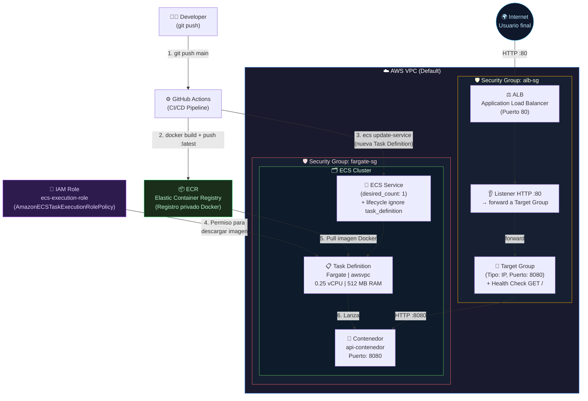

# Fase 3: ECS Fargate + Application Load Balancer (ALB) 🚀

He pasado de gestionar un servidor EC2 a mano, a orquestarlo con ECS en EC2, y ahora doy el salto a la **arquitectura Serverless** con **AWS Fargate** y balanceo de carga profesional.

## 🎯 Objetivo de esta fase
Desplegar mi API de Python en contenedores de forma **Serverless** (sin gestionar servidores) y exponerla a Internet de forma profesional usando un **Load Balancer**, con despliegue automático vía **GitHub Actions**.

---

## 🏗️ Diagrama de la Arquitectura Completa

Este es el flujo completo desde que un usuario hace una petición hasta que el contenedor responde:



---

## 🔍 Explicación de cada componente

### 🌐 Networking (`networking.tf`)
No me he complicado y he reutilizado la **VPC por defecto** de la cuenta de AWS, que ya tiene subredes en múltiples zonas de disponibilidad. El ALB requiere al menos 2 subredes para garantizar alta disponibilidad.

---

### 🔑 IAM — Identidad y Permisos (`iam.tf`)
AWS Fargate corre en **máquinas de Amazon, no mías**. Eso significa que cuando el contenedor intenta descargar la imagen de ECR, necesita que alguien le "firme" el permiso. Ahí entra el **IAM Role**.

| Recurso | Qué hace |
|---|---|
| `aws_iam_role` | Crea un rol con una **política de confianza** que dice: *"Solo el servicio `ecs-tasks.amazonaws.com` puede asumir este rol"* |
| `aws_iam_role_policy_attachment` | Adjunta la política oficial `AmazonECSTaskExecutionRolePolicy` al rol. Esta política permite a Fargate descargar imágenes de ECR y escribir logs en CloudWatch |

> **Sin este rol, el contenedor arrancaría pero fallaría al intentar descargar la imagen de ECR.**

---

### 📦 ECR — Elastic Container Registry (`ecr.tf`)
Es el **Docker Hub privado de AWS**. En lugar de usar Docker Hub público, subo mis imágenes aquí para que solo mi infraestructura de AWS pueda acceder a ellas.

| Atributo | Valor | Explicación |
|---|---|---|
| `image_tag_mutability` | `MUTABLE` | Permite sobrescribir el tag `:latest` con cada push |
| `force_delete` | `true` | Permite a `terraform destroy` borrar el repositorio aunque tenga imágenes |
| `scan_on_push` | `true` | Escanea automáticamente cada imagen en busca de vulnerabilidades de seguridad |

---

### 🛡️ Security Groups — Cortafuegos (`security.tf`)
La seguridad está diseñada en **dos capas**, como una cebolla:

#### Capa 1: `alb-sg` (Cortafuegos del Load Balancer)
```
Internet (0.0.0.0/0) ──── :80 TCP ────► ALB
                     ◄─── Todo ─────── ALB (salida)
```
- **Entrada**: Permite que **cualquier persona en Internet** llegue al ALB por el puerto 80.
- **Salida**: Permite que el ALB envíe tráfico hacia donde necesite (hacia los contenedores).

#### Capa 2: `fargate-sg` (Cortafuegos del Contenedor)
```
alb-sg ──── :8080 TCP ────► Contenedor Fargate
       ◄─── Todo ─────────  Contenedor Fargate (salida a Internet/ECR)
```
- **Entrada**: SOLO acepta tráfico en el puerto 8080 **si viene del `alb-sg`**. Un atacante que intente conectarse directamente a la IP del contenedor será rechazado.
- **Salida**: Permite salida total para que el contenedor pueda descargar la imagen de ECR y paquetes de sistema.

> **Clave de seguridad**: En la regla de entrada del `fargate-sg`, en vez de poner una IP, se referencia directamente el ID del `alb-sg`. Esto significa "solo acepto tráfico de quien tenga este Security Group asignado", que es exclusivamente el ALB.

---

### ⚖️ ALB — Application Load Balancer (`alb.tf`)
El ALB es la **única puerta de entrada pública** de la arquitectura. Tiene tres sub-componentes:

#### 1. El Balanceador (`aws_lb`)
El recurso físico del ALB. Recibe una IP pública y un DNS automático de AWS (ej: `mi-alb-1234.us-east-1.elb.amazonaws.com`). Necesita estar en **mínimo 2 subredes** por alta disponibilidad.

#### 2. El Listener (`aws_lb_listener`)
Es la "oreja" del ALB. Está configurado para escuchar en el **puerto 80 (HTTP)** y enviar (`forward`) todo lo que llegue al Target Group.

#### 3. El Target Group (`aws_lb_target_group`)
Es la lista de destinos a los que el ALB puede enviar tráfico. Puntos clave:
- `target_type = "ip"`: **Crítico para Fargate**. Los contenedores Fargate no tienen una instancia EC2 fija, sino una IP dinámica. ECS registra y desregistra automáticamente esas IPs en el Target Group al crear/destruir contenedores.
- `port = 8080`: El tráfico llega al contenedor por el puerto 8080.
- **Health Check**: Cada 30 segundos el ALB hace una petición `GET /` al contenedor. Si responde con `200 OK` dos veces seguidas → contenedor sano ✅. Si falla dos veces → el ALB deja de enviarle tráfico ❌.

#### 4. El Output (`output "alb_url"`)
Al terminar `terraform apply`, Terraform imprime en pantalla la URL pública del ALB con formato `http://...` para que puedas acceder directamente sin entrar a la consola de AWS.

---

### 🐳 ECS + Fargate — El Orquestador (`ecs.tf`)
ECS (Elastic Container Service) es el sistema que gestiona los contenedores. Fargate es el **modo de ejecución Serverless**: tú defines qué necesitas (CPU, RAM, imagen) y AWS busca dónde ejecutarlo sin que veas ningún servidor.

Tiene tres recursos principales:

#### 1. Cluster ECS (`aws_ecs_cluster`)
El **contenedor lógico** que agrupa todos los servicios y tareas. Es simplemente un nombre que une todos los recursos de ECS. No tiene coste propio.

#### 2. Task Definition (`aws_ecs_task_definition`)
Es la **"receta"** del contenedor, como un `docker-compose.yml` pero para AWS:

| Campo | Valor | Explicación |
|---|---|---|
| `requires_compatibilities` | `FARGATE` | Declara que esta tarea es Serverless |
| `network_mode` | `awsvpc` | Obligatorio en Fargate. Cada contenedor recibe su propia interfaz de red e IP privada |
| `cpu` / `memory` | `256` / `512` | 0.25 vCPU y 512 MB de RAM para el contenedor |
| `execution_role_arn` | `iam_role.arn` | El rol IAM que Fargate usará para descargar la imagen de ECR |
| `image` | `ecr_repo:latest` | Imagen Docker a ejecutar, apuntando al repositorio ECR |
| `containerPort` | `8080` | Puerto en el que escucha la API dentro del contenedor |

#### 3. ECS Service (`aws_ecs_service`)
El **"vigilante"** que se asegura de que siempre haya exactamente `desired_count = 1` copia del contenedor corriendo. Si el contenedor se cae, el servicio lanza uno nuevo automáticamente.

**`lifecycle { ignore_changes = [task_definition] }`**: Esta configuración es fundamental para la integración con CI/CD. Cuando GitHub Actions despliega una nueva versión de la app, actualiza la Task Definition en ECS directamente. Sin este `lifecycle`, la próxima vez que ejecutes `terraform apply` para cambiar otra cosa (ej: más RAM), Terraform intentaría revertir la Task Definition a la versión que él conoce, ¡deshaciendo el despliegue de GitHub Actions!

**`depends_on = [aws_lb_listener.http]`**: Garantiza que el Listener del ALB esté creado antes de que el ECS Service intente registrarse en el Target Group.

---

## 🔄 El Flujo Completo Paso a Paso

```
1. [DEV]  git push origin main
      │
2. [GHA]  GitHub Actions se activa
      │   → docker build -t mi-api .
      │   → docker tag mi-api  <ECR_URL>:latest
      │   → docker push        <ECR_URL>:latest
      │   → aws ecs update-service --force-new-deployment
      │
3. [IAM]  Fargate asume el ecs-execution-role
      │   → Obtiene permiso para leer ECR y escribir en CloudWatch
      │
4. [ECR]  Fargate descarga la imagen Docker :latest
      │
5. [ECS]  El ECS Service lanza una nueva Task (contenedor)
      │   con la nueva imagen
      │   → Registra la IP del contenedor en el Target Group
      │   → El ALB empieza a enviar tráfico al nuevo contenedor
      │   → El contenedor viejo se detiene (zero-downtime deploy)
      │
6. [USER] El usuario accede a http://<alb_url>
      │   → ALB (puerto 80) recibe la petición
      │   → Listener HTTP hace forward al Target Group
      │   → Target Group envía la petición al contenedor (puerto 8080)
      └── La API responde con el resultado
```

---

## 🚀 Cómo desplegarlo

```bash
# 1. Posicionarse en la carpeta
cd Evolucion-Contenedores-AWS/03_ECS_Fargate

# 2. Inicializar Terraform (descarga los providers de AWS)
terraform init

# 3. Ver qué va a crear antes de hacerlo
terraform plan

# 4. Desplegar toda la infraestructura (escribir "yes" para confirmar)
terraform apply
```

Al finalizar, Terraform imprimirá algo como:
```
Outputs:
  alb_url = "http://mi-proyecto-alb-1234567890.us-east-1.elb.amazonaws.com"
```
Esa URL es tu API en producción. Si la pones ahora no funcionará porque has creado toda la arquitectura (ECR, ECS...) con Terraform pero aún no has añadido la imagen Docker en ECS.

Para desplegar la imagen Docker en ECS, debes ejecutar el workflow de GitHub Actions. 

En este repositorio vete a Actions > Fase 3: Despliegue ECS + Fargate > Run workflow > Run workflow. Tardará un poco dale tiempo 2- 3 min y cuando te de el check verde ya podrás entrar a tu API.

---

## ⚠️ IMPORTANTE: Costes y Limpieza

> **¡CUIDADO!** Un Application Load Balancer tiene un coste fijo mensual de aprox. **16-20 $/mes** si se deja encendido. Fargate cobra por segundos de CPU y RAM usados.

**Cuando termines de probar, destruye toda la infraestructura:**
```bash
terraform destroy
```
